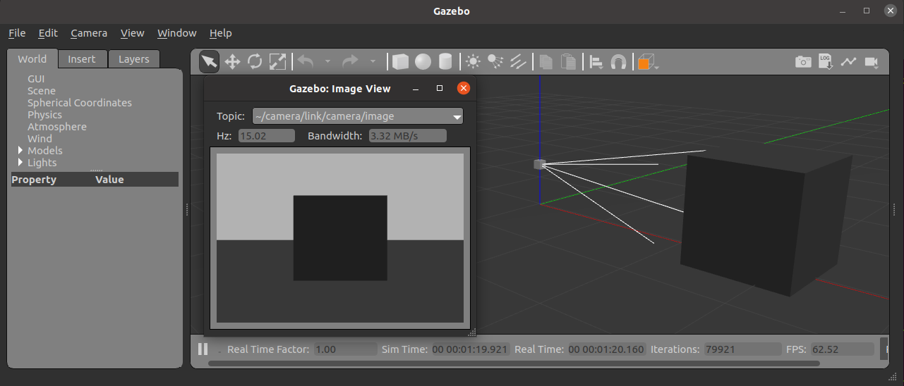
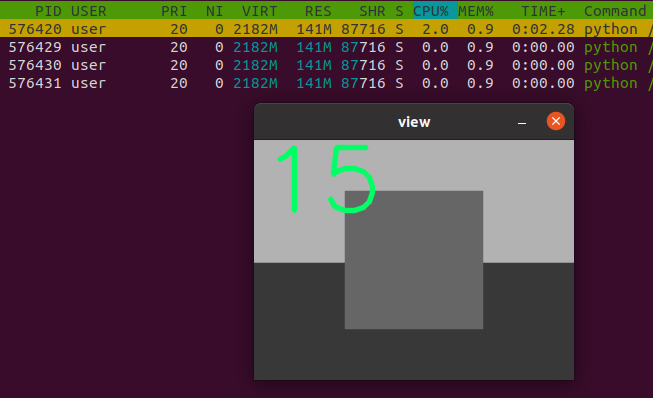

# Camera

```xml title="camera.world" 
{{include("gz/worlds/camera.world")}}
```

```xml title="camera.world" 
{{include("gz/models/my_camera/camera.sdf")}}
```

!!! Note
    Camera topic got it's name from 
    `model_name/link_name/sensor_name`



```bash title="gz topic -l" linenums="1" hl_lines="1 5"
gz topic -l
# Result
/gazebo/default/atmosphere
/gazebo/default/camera/link/camera/cmd
/gazebo/default/camera/link/camera/image
/gazebo/default/diagnostics
```

```bash title="bandwidth" linenums="1" hl_lines="1"
gz topic -b /gazebo/default/camera/link/camera/image
# Result
Total[3.51 MB/s] Mean[225.03 KB] Min[225.03 KB] Max[225.03 KB] Messages[16]
Total[3.51 MB/s] Mean[225.03 KB] Min[225.03 KB] Max[225.03 KB] Messages[15]
```

---

## Read data from gazebo
- Using pygazebo package

```python title="camera_view.py" linenums="1" hl_lines="16 28"
{{include("examples/gazebo/camera_viewer.py")}}
```

