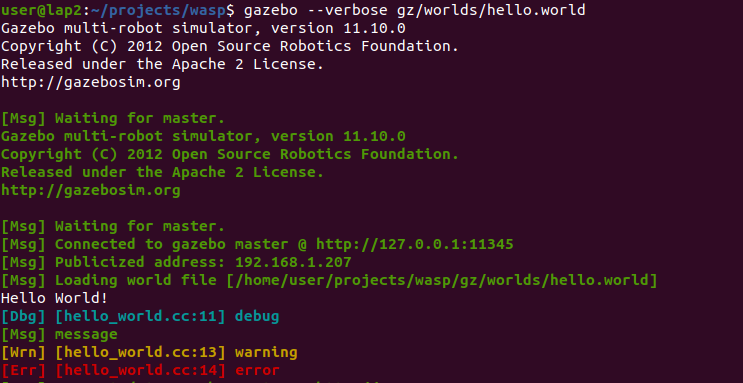

# Plugin 101
There are currently 6 types of plugins

- World
- Model
- Sensor
- System
- Visual
- GUI

## hello plugins
### world plugin

```cpp title="hello_world.cc"
{{include("gz/plugins/hello_world/hello_world.cc")}}
```

```cmake title="CMakeLists.txt" linenums="1" hl_lines="6 10"
find_package(gazebo REQUIRED)
include_directories(${GAZEBO_INCLUDE_DIRS})
link_directories(${GAZEBO_LIBRARY_DIRS})
list(APPEND CMAKE_CXX_FLAGS "${GAZEBO_CXX_FLAGS}")

SET(CMAKE_INSTALL_PREFIX ${CMAKE_SOURCE_DIR})

add_library(hello_world SHARED hello_world/hello_world.cc)
target_link_libraries(hello_world ${GAZEBO_LIBRARIES})
install(TARGETS hello_world DESTINATION bin)
```

!!! Note
    `make install` copy binaries to `bin` project folder
    gazebo environment  variable `GAZEBO_PLUGIN_PATH` need to include this folder

```xml title="hello.world"
{{include("gz/worlds/hello.world") }}
```

#### Run
```
gazebo --verbose worlds/hello.world
```

